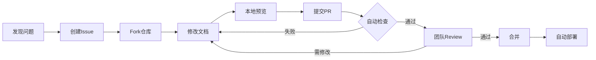

# Picto CLI - 系统架构设计文档

> **文档性质**: 技术架构设计文档  
> **目标读者**: 开发团队、技术决策者、贡献者  
> **文档版本**: v2.0.0  
> **最后更新**: 2026-01-20

---

## 📑 文档目录

1. [项目概述](#1-项目概述)
2. [系统架构设计](#2-系统架构设计)
3. [核心功能模块](#3-核心功能模块)
4. [技术栈选型](#4-技术栈选型)
5. [工程化配置](#5-工程化配置)
6. [阶段性开发计划](#6-阶段性开发计划)
7. [质量保证体系](#7-质量保证体系)
8. [部署与发布](#8-部署与发布)
9. [文档管理体系](#9-文档管理体系)

---

## 1. 项目概述

### 1.1 项目定位

**Picto** 是一款面向现代前端开发的图标管理工具，旨在解决设计资源到代码组件的自动化转换问题。

**核心价值**：
- 🎯 **统一管理**: 一个工具管理多个图标来源（Figma、Iconfont、本地SVG）
- ⚡ **类型安全**: 端到端TypeScript支持，零运行时错误
- 🔌 **高度可扩展**: 插件化架构，支持自定义扩展
- 🚀 **开发者友好**: 零配置启动，支持深度定制

### 1.2 目标用户

1. **前端开发者**: 需要快速集成图标到项目中
2. **设计系统维护者**: 需要持续同步设计资源
3. **开源项目**: 需要自动化CI/CD流程
4. **企业团队**: 需要统一的图标管理方案

### 1.3 核心场景

```
场景1: 快速启动
  开发者 → 执行 picto init → 零配置拉取图标 → 自动生成组件

场景2: 持续同步
  设计师更新Figma → CI自动触发picto sync → 自动提交代码

场景3: 多框架支持
  单一图标源 → Picto处理 → 输出React/Vue/Svelte等多种格式
```

---

## 2. 系统架构设计

### 2.1 整体架构图

```
┌─────────────────────────────────────────────────────────────────┐
│                     CLI Interface Layer                          │
│                    (用户交互层 - CAC)                             │
│  - 命令解析  - 参数验证  - 帮助文档  - 错误提示                   │
└───────────────────────────┬─────────────────────────────────────┘
                            │
┌───────────────────────────▼─────────────────────────────────────┐
│                     Core Engine Layer                            │
│                      (核心引擎层)                                 │
│  ┌──────────────┐  ┌──────────────┐  ┌──────────────┐          │
│  │ Config       │  │ Cache        │  │ Logger       │          │
│  │ Manager      │  │ Manager      │  │ System       │          │
│  └──────────────┘  └──────────────┘  └──────────────┘          │
│                                                                  │
│  ┌─────────────────────────────────────────────────────────┐   │
│  │              Pipeline Orchestrator                       │   │
│  │         (流程编排器 - 控制数据流转)                       │   │
│  └─────────────────────────────────────────────────────────┘   │
└───────────────────────────┬─────────────────────────────────────┘
                            │
┌───────────────────────────▼─────────────────────────────────────┐
│                    Plugin System Layer                           │
│                     (插件系统层)                                  │
│  - 插件注册  - 生命周期管理  - 插件通信  - 错误隔离              │
└─────┬──────────────────┬──────────────────┬─────────────────────┘
      │                  │                  │
┌─────▼──────┐  ┌────────▼────────┐  ┌─────▼──────────┐
│  Source    │  │   Processor     │  │   Generator    │
│  Plugins   │  │   Plugins       │  │   Plugins      │
└─────┬──────┘  └────────┬────────┘  └─────┬──────────┘
      │                  │                  │
┌─────▼──────┐  ┌────────▼────────┐  ┌─────▼──────────┐
│ • Figma    │  │ • Normalizer    │  │ • React        │
│ • Iconfont │  │ • Optimizer     │  │ • Vue          │
│ • Local    │  │ • Analyzer      │  │ • Svelte       │
│ • Sketch   │  │ • Deduplicator  │  │ • WebComp      │
└────────────┘  └─────────────────┘  └────────────────┘
      │                  │                  │
      └──────────────────┴──────────────────┘
                         │
               ┌─────────▼──────────┐
               │  Unified Data Model │
               │  (IconMetadata[])   │
               └────────────────────┘
                         │
               ┌─────────▼──────────┐
               │   File System       │
               │   Output Layer      │
               └────────────────────┘
```

### 2.2 分层设计说明

#### **第一层：CLI Interface Layer (CLI接口层)**

**职责**：
- 解析用户命令和参数
- 验证输入合法性
- 提供友好的帮助文档
- 错误信息美化输出

**技术实现**：
- 框架：CAC (轻量级CLI框架)
- 终端美化：chalk (颜色)、ora (加载动画)
- 交互提示：prompts

**核心命令**：
```bash
picto init          # 初始化配置
picto pull          # 拉取图标
picto sync          # 同步图标
picto dev           # 开发模式(watch)
picto build         # 生产构建
```

#### **第二层：Core Engine Layer (核心引擎层)**

**职责**：
- 统一配置管理（加载、验证、合并）
- 缓存管理（提升性能）
- 日志系统（调试和监控）
- 流程编排（协调各个插件工作）

**核心组件**：

```typescript
// 1. Config Manager (配置管理器)
class ConfigManager {
  load(): Promise<Config>          // 加载配置
  validate(): ValidationResult     // 验证配置
  merge(): Config                  // 合并默认配置
}

// 2. Cache Manager (缓存管理器)
class CacheManager {
  get(key: string): Promise<any>   // 读取缓存
  set(key: string, value: any)     // 写入缓存
  clear(): Promise<void>           // 清空缓存
}

// 3. Pipeline Orchestrator (流程编排器)
class PipelineOrchestrator {
  execute(): Promise<void> {
    // Step 1: 加载配置
    // Step 2: 初始化插件
    // Step 3: 从源拉取数据
    // Step 4: 数据处理转换
    // Step 5: 生成输出文件
    // Step 6: 清理资源
  }
}
```

#### **第三层：Plugin System Layer (插件系统层)**

**职责**：
- 动态加载插件
- 管理插件生命周期
- 提供插件间通信机制
- 隔离插件错误

**插件分类**：

1. **Source Plugins (数据源插件)**
   - 从不同来源拉取图标数据
   - 示例：Figma、Iconfont、本地SVG

2. **Processor Plugins (处理器插件)**
   - 对图标数据进行转换和优化
   - 示例：名称规范化、SVG优化、去重

3. **Generator Plugins (生成器插件)**
   - 生成不同格式的输出文件
   - 示例：React组件、Vue组件、JSON索引

**插件接口设计**：

```typescript
// 基础插件接口
interface Plugin {
  name: string
  version: string
  type: 'source' | 'processor' | 'generator'
  
  // 生命周期钩子
  setup?(context: PluginContext): Promise<void>
  teardown?(): Promise<void>
}

// 数据源插件
interface SourcePlugin extends Plugin {
  type: 'source'
  fetch(config: SourceConfig): Promise<RawIconData[]>
}

// 处理器插件
interface ProcessorPlugin extends Plugin {
  type: 'processor'
  process(data: IconMetadata[]): Promise<IconMetadata[]>
}

// 生成器插件
interface GeneratorPlugin extends Plugin {
  type: 'generator'
  generate(data: IconMetadata[], config: OutputConfig): Promise<void>
}
```

### 2.3 数据流转设计

```
┌─────────────────┐
│   Raw Data      │  来自API或文件系统的原始数据
│   (各种格式)     │
└────────┬────────┘
         │ Source Plugin
         ▼
┌─────────────────┐
│  RawIconData[]  │  统一的原始数据格式
└────────┬────────┘
         │ Normalizer
         ▼
┌─────────────────┐
│ IconMetadata[]  │  规范化的图标元数据
└────────┬────────┘
         │ Processor Plugins
         ├─→ Optimizer (SVG优化)
         ├─→ Analyzer (颜色分析)
         └─→ Deduplicator (去重)
         ▼
┌─────────────────┐
│ Processed Data  │  处理后的图标数据
└────────┬────────┘
         │ Generator Plugins
         ├─→ React Generator
         ├─→ Vue Generator
         └─→ JSON Generator
         ▼
┌─────────────────┐
│  Output Files   │  最终生成的文件
│  (components)   │
└─────────────────┘
```

### 2.4 核心数据模型

```typescript
// 统一的图标元数据模型
interface IconMetadata {
  // 基础标识
  id: string                      // 全局唯一ID
  name: string                    // 规范化名称 (kebab-case)
  originalName: string            // 原始名称
  
  // 来源信息
  source: {
    type: 'figma' | 'iconfont' | 'local' | 'sketch'
    id: string                    // 源中的ID
    url?: string                  // 源URL
    fileKey?: string              // Figma fileKey
  }
  
  // SVG数据
  svg: {
    content: string               // SVG内容(不含<svg>标签)
    viewBox: string               // viewBox属性
    width?: number                // 宽度
    height?: number               // 高度
    optimized?: string            // 优化后的SVG
  }
  
  // 分类和标签
  category?: string               // 分类
  tags?: string[]                 // 标签
  
  // 变体信息
  variant?: {
    style?: 'filled' | 'outlined' | 'rounded'
    weight?: 'thin' | 'light' | 'regular' | 'bold'
    size?: number
  }
  
  // 颜色信息
  colorInfo: {
    type: 'monochrome' | 'duotone' | 'multicolor'
    palette: string[]             // 颜色列表
    isConfigurable: boolean       // 是否可配置颜色
  }
  
  // 元数据
  metadata: {
    description?: string
    author?: string
    license?: string
    createdAt?: Date
    updatedAt?: Date
  }
  
  // 内部字段
  _hash?: string                  // 内容哈希(用于缓存)
  _sourceData?: any               // 原始数据(用于调试)
}
```

---

## 3. 核心功能模块

### 3.1 功能清单

| 模块 | 功能 | 优先级 | 说明 |
|------|------|--------|------|
| **数据源集成** | | | |
| └ Figma集成 | 支持File/Component/Node级别拉取 | P0 | MVP必需 |
| └ Iconfont集成 | 支持项目ID和CSS解析 | P0 | MVP必需 |
| └ 本地SVG扫描 | 扫描指定目录的SVG文件 | P0 | MVP必需 |
| └ Sketch集成 | 通过Sketch API | P1 | v1.2 |
| **数据处理** | | | |
| └ 名称规范化 | 支持多种命名风格转换 | P0 | MVP必需 |
| └ SVG优化 | 使用SVGO压缩优化 | P0 | MVP必需 |
| └ 颜色分析 | 识别单色/双色/多色 | P1 | v1.1 |
| └ 变体识别 | 自动识别filled/outlined等 | P1 | v1.1 |
| └ 去重处理 | 基于内容哈希去重 | P1 | v1.1 |
| **代码生成** | | | |
| └ React组件 | TypeScript + JSX | P0 | MVP必需 |
| └ Vue组件 | Vue 3 + Composition API | P0 | MVP必需 |
| └ Web Components | 标准Web Components | P1 | v1.1 |
| └ Svelte组件 | Svelte 4+ | P1 | v1.2 |
| └ 图标字体 | TTF/WOFF2 + CSS | P1 | v1.1 |
| └ JSON索引 | Iconify格式兼容 | P0 | MVP必需 |
| └ TypeScript类型 | 图标名称类型定义 | P0 | MVP必需 |
| **配置系统** | | | |
| └ 零配置模式 | 约定优于配置 | P0 | MVP必需 |
| └ 配置文件 | TS/JSON/YAML格式 | P0 | MVP必需 |
| └ CLI参数覆盖 | 命令行参数优先级最高 | P0 | MVP必需 |
| └ 交互式配置 | CLI问答式设置 | P1 | v1.1 |
| **开发体验** | | | |
| └ Watch模式 | 监听文件变化自动重新生成 | P0 | MVP必需 |
| └ 增量更新 | 只处理变化的图标 | P1 | v1.1 |
| └ 缓存机制 | 避免重复下载和处理 | P1 | v1.1 |
| └ 预览服务器 | 本地预览图标库 | P2 | v1.2 |
| └ VS Code插件 | 图标预览和自动完成 | P2 | v2.0 |
| **高级特性** | | | |
| └ 插件系统 | 社区扩展支持 | P1 | v1.2 |
| └ CI/CD集成 | GitHub Actions支持 | P1 | v1.1 |
| └ 并发优化 | 多线程下载和处理 | P1 | v1.1 |
| └ Design Token | 同步设计Token | P2 | v2.0 |

### 3.2 核心功能实现细节

#### 3.2.1 Figma集成模块

**功能说明**：
从Figma文件中拉取图标，支持多种粒度的拉取方式。

**技术实现**：

```typescript
// Figma Source Plugin
class FigmaSourcePlugin implements SourcePlugin {
  name = 'figma'
  version = '1.0.0'
  type = 'source' as const
  
  async fetch(config: FigmaSourceConfig): Promise<RawIconData[]> {
    // 1. 解析Figma URL，提取fileKey
    const fileKey = this.extractFileKey(config.url)
    
    // 2. 调用Figma API获取文件数据
    const file = await this.fetchFile(fileKey, config.token)
    
    // 3. 遍历文档树，提取图标节点
    const iconNodes = this.extractIconNodes(file, config)
    
    // 4. 批量下载SVG
    const svgs = await this.fetchSVGs(iconNodes, fileKey, config.token)
    
    // 5. 转换为统一格式
    return this.transformToRawData(svgs, iconNodes)
  }
  
  private extractIconNodes(file: FigmaFile, config: FigmaSourceConfig): FigmaNode[] {
    // 递归遍历文档树
    // 根据节点类型(COMPONENT/COMPONENT_SET)和名称过滤
    // 支持通过componentSets和nodeIds精确指定
  }
  
  private async fetchSVGs(nodes: FigmaNode[], fileKey: string, token: string): Promise<string[]> {
    // 使用并发控制批量下载
    // 每批10个，避免API限流
    const BATCH_SIZE = 10
    const results = []
    
    for (let i = 0; i < nodes.length; i += BATCH_SIZE) {
      const batch = nodes.slice(i, i + BATCH_SIZE)
      const batchResults = await Promise.all(
        batch.map(node => this.fetchNodeSVG(node.id, fileKey, token))
      )
      results.push(...batchResults)
    }
    
    return results
  }
}
```

**配置示例**：

```typescript
// picto.config.ts
export default {
  sources: [
    {
      type: 'figma',
      url: 'https://www.figma.com/file/ABC123/My-Icons',
      token: process.env.FIGMA_TOKEN,
      
      // 可选：指定具体的组件集
      componentSets: ['Icons/System', 'Icons/Brand'],
      
      // 可选：过滤规则
      filters: {
        namePattern: /^icon-/,  // 只匹配以icon-开头的
        variants: ['filled', 'outlined']
      }
    }
  ]
}
```

#### 3.2.2 代码生成模块

**功能说明**：
根据图标数据生成不同框架的组件代码。

**React生成器实现**：

```typescript
// React Generator Plugin
import prettier from 'prettier'

class ReactGeneratorPlugin implements GeneratorPlugin {
  name = 'react'
  version = '1.0.0'
  type = 'generator' as const
  
  async generate(icons: IconMetadata[], config: ReactOutputConfig): Promise<void> {
    // 1. 为每个图标生成组件文件
    for (const icon of icons) {
      const componentCode = await this.renderComponent(icon, config)
      const fileName = `${icon.name}.tsx`
      await fs.writeFile(
        path.join(config.dir, fileName),
        componentCode
      )
    }
    
    // 2. 生成index.ts导出文件
    await this.generateIndex(icons, config)
    
    // 3. 生成TypeScript类型定义
    await this.generateTypes(icons, config)
  }
  
  private async renderComponent(
    icon: IconMetadata, 
    config: ReactOutputConfig
  ): Promise<string> {
    // 组件名称：PascalCase
    const componentName = toPascalCase(icon.name)
    const svgContent = icon.svg.optimized || icon.svg.content
    const defaultSize = config.defaultProps?.size || 24
    const defaultColor = config.defaultProps?.color || 'currentColor'
    const useMemo = config.memo !== false
    
    // 使用Template Strings生成代码
    const code = `
import React from 'react';

export interface ${componentName}Props extends React.SVGProps<SVGSVGElement> {
  size?: number | string;
  color?: string;
}

${useMemo ? `export const ${componentName}: React.FC<${componentName}Props> = React.memo(({` : `export const ${componentName}: React.FC<${componentName}Props> = ({`}
  size = ${defaultSize},
  color = '${defaultColor}',
  ...props
}) => {
  return (
    <svg
      width={size}
      height={size}
      viewBox="${icon.svg.viewBox}"
      fill="none"
      {...props}
    >
      ${svgContent}
    </svg>
  );
}${useMemo ? ')' : ''};

${componentName}.displayName = '${componentName}';
`
    
    // 使用Prettier格式化代码
    return prettier.format(code, {
      parser: 'typescript',
      semi: false,
      singleQuote: true,
      trailingComma: 'es5'
    })
  }
  
  private async generateTypes(icons: IconMetadata[], config: ReactOutputConfig): Promise<void> {
    // 生成图标名称的TypeScript类型
    const iconNames = icons.map(i => `'${i.name}'`).join(' | ')
    const typeCode = `export type IconName = ${iconNames}`
    
    const formatted = await prettier.format(typeCode, { parser: 'typescript' })
    
    await fs.writeFile(
      path.join(config.dir, 'types.ts'),
      formatted
    )
  }
}
```

**生成的React组件示例**：

```tsx
// arrow-left.tsx
import React from 'react'

export interface IconProps extends React.SVGProps<SVGSVGElement> {
  size?: number | string
  color?: string
}

export const IconArrowLeft: React.FC<IconProps> = React.memo(({
  size = 24,
  color = 'currentColor',
  ...props
}) => {
  return (
    <svg
      width={size}
      height={size}
      viewBox="0 0 24 24"
      fill="none"
      stroke={color}
      {...props}
    >
      <path d="M19 12H5M12 19l-7-7 7-7" strokeWidth="2" strokeLinecap="round" strokeLinejoin="round"/>
    </svg>
  )
})

IconArrowLeft.displayName = 'IconArrowLeft'
```

#### 3.2.3 缓存管理模块

**功能说明**：
智能缓存机制，避免重复下载和处理，提升性能。

**实现细节**：

```typescript
// Cache Manager
class CacheManager {
  private cacheDir: string
  private defaultTTL: number = 86400 // 24小时
  
  constructor(config: CacheConfig) {
    this.cacheDir = config.dir || '.picto/cache'
    this.defaultTTL = config.ttl || 86400
  }
  
  async get<T>(key: string): Promise<T | null> {
    const cachePath = this.getCachePath(key)
    
    // 检查缓存文件是否存在
    if (!await fs.pathExists(cachePath)) {
      return null
    }
    
    // 读取缓存
    const cached = await fs.readJSON(cachePath)
    
    // 检查是否过期
    if (this.isExpired(cached)) {
      await fs.remove(cachePath)
      return null
    }
    
    return cached.data
  }
  
  async set<T>(key: string, data: T, ttl?: number): Promise<void> {
    const cachePath = this.getCachePath(key)
    
    await fs.outputJSON(cachePath, {
      data,
      timestamp: Date.now(),
      ttl: ttl || this.defaultTTL
    })
  }
  
  // 生成基于内容的缓存key
  generateKey(icon: IconMetadata): string {
    return crypto
      .createHash('md5')
      .update(JSON.stringify({
        source: icon.source,
        originalName: icon.originalName,
        svg: icon.svg.content
      }))
      .digest('hex')
  }
  
  private isExpired(cached: CacheEntry): boolean {
    const now = Date.now()
    const age = (now - cached.timestamp) / 1000
    return age > cached.ttl
  }
}
```

---

## 4. 技术栈选型

### 4.1 核心技术栈

| 技术分类 | 选型 | 版本 | 选型理由 |
|---------|------|------|---------|
| **语言** | TypeScript | 5.3+ | 类型安全、生态丰富、社区友好 |
| **运行时** | Node.js | 18+ | 稳定版本、ESM支持完善 |
| **CLI框架** | CAC | ^6.7 | 轻量(5KB)、API简洁、TS支持好 |
| **HTTP客户端** | ofetch | ^1.3 | 基于Fetch API、自动重试、类型安全 |
| **代码生成** | Template Strings + Prettier | ^3.2 | 原生特性、类型安全、零依赖 |
| **Schema验证** | Zod | ^4.0 | 类型推导、友好的错误提示 |
| **SVG优化** | SVGO | ^3.2 | 业界标准、插件丰富 |
| **构建工具** | tsup | ^8.0 | 零配置、基于esbuild、极快 |
| **测试框架** | Vitest | ^1.2 | 快速、现代、与Vite生态集成 |
| **终端美化** | chalk + ora + consola | latest | 提升用户体验 |
| **文件操作** | fs-extra | ^11.2 | Promise API、功能丰富 |
| **配置合并** | defu | ^6.1 | 深度合并、类型安全 |

### 4.2 技术选型详细说明

#### 4.2.1 为什么选择CAC而不是Oclif？

**CAC优势**：
- ✅ 轻量级(5KB)，启动速度快
- ✅ API简洁直观，学习成本低
- ✅ TypeScript原生支持
- ✅ 足够满足当前需求

**Oclif特点**：
- 🔶 功能强大，但体积较大(影响启动速度)
- 🔶 适合大型复杂CLI工具
- 🔶 学习曲线较陡

**决策**：MVP阶段使用CAC，如果未来需要更复杂的插件生态，可以迁移到Oclif。

#### 4.2.2 为什么选择Template Strings而不是模板引擎？

**Template Strings优势**：
- ✅ 原生TypeScript特性，零额外依赖
- ✅ 完美的类型安全和IDE支持
- ✅ 灵活性高，可以直接使用JavaScript逻辑
- ✅ 易于调试，代码即模板
- ✅ 结合Prettier自动格式化，代码质量有保证

**为什么不用Handlebars/EJS？**：
- 🔶 额外的依赖和学习成本
- 🔶 类型支持不够完善
- 🔶 对于简单的代码生成场景过于复杂
- 🔶 调试相对困难

#### 4.2.3 为什么选择Zod而不是JSON Schema？

```typescript
// Zod的优势：类型定义即验证规则
const ConfigSchema = z.object({
  sources: z.array(z.discriminatedUnion('type', [
    z.object({
      type: z.literal('figma'),
      url: z.string().url(),
      token: z.string()
    }),
    z.object({
      type: z.literal('iconfont'),
      projectId: z.string()
    })
  ]))
})

// 自动推导类型
type Config = z.infer<typeof ConfigSchema>

// 验证时提供友好的错误提示
const result = ConfigSchema.safeParse(userConfig)
if (!result.success) {
  console.error(result.error.format())
}
```

**优势**：
- ✅ 类型定义和验证规则合二为一
- ✅ 自动类型推导，减少重复代码
- ✅ 错误提示友好
- ✅ 可组合的Schema设计

### 4.3 依赖包清单

```json
{
  "name": "@picto/cli",
  "version": "1.0.0",
  "dependencies": {
    "cac": "^6.7.14",
    "ofetch": "^1.3.3",
    "zod": "^4.0.1",
    "prettier": "^3.2.4",
    "svgo": "^3.2.0",
    "ora": "^7.0.1",
    "chalk": "^5.3.0",
    "consola": "^3.2.3",
    "fast-glob": "^3.3.2",
    "fs-extra": "^11.2.0",
    "dotenv": "^16.4.1",
    "defu": "^6.1.4",
    "chokidar": "^3.5.3"
  },
  "devDependencies": {
    "typescript": "^5.3.3",
    "tsup": "^8.0.1",
    "vitest": "^1.2.0",
    "@types/node": "^20.11.5",
    "@types/fs-extra": "^11.0.4",
    "eslint": "^8.56.0"
  }
}
```

---

## 5. 工程化配置

### 5.1 项目文件组织结构

```
picto/
├── packages/                        # Monorepo包目录
│   ├── core/                        # 核心包 @picto/core
│   │   ├── src/
│   │   │   ├── engine/             # 核心引擎
│   │   │   │   ├── Engine.ts       # 主引擎
│   │   │   │   ├── Pipeline.ts     # 流程编排
│   │   │   │   └── Context.ts      # 执行上下文
│   │   │   ├── plugins/            # 插件系统
│   │   │   │   ├── PluginManager.ts
│   │   │   │   ├── sources/        # 数据源插件
│   │   │   │   │   ├── figma.ts
│   │   │   │   │   ├── iconfont.ts
│   │   │   │   │   └── local.ts
│   │   │   │   ├── processors/     # 处理器插件
│   │   │   │   │   ├── normalizer.ts
│   │   │   │   │   ├── optimizer.ts
│   │   │   │   │   └── analyzer.ts
│   │   │   │   └── generators/     # 生成器插件
│   │   │   │       ├── react.ts
│   │   │   │       ├── vue.ts
│   │   │   │       └── json.ts
│   │   │   ├── config/             # 配置管理
│   │   │   │   ├── loader.ts
│   │   │   │   ├── validator.ts
│   │   │   │   └── schema.ts
│   │   │   ├── cache/              # 缓存管理
│   │   │   │   └── CacheManager.ts
│   │   │   ├── utils/              # 工具函数
│   │   │   │   ├── naming.ts
│   │   │   │   ├── svg.ts
│   │   │   │   ├── logger.ts
│   │   │   │   └── hash.ts
│   │   │   └── types/              # 类型定义
│   │   │       ├── icon.ts
│   │   │       ├── config.ts
│   │   │       └── plugin.ts
│   │   ├── tests/                  # 测试文件
│   │   │   ├── unit/
│   │   │   └── integration/
│   │   ├── package.json
│   │   ├── tsconfig.json
│   │   └── tsup.config.ts
│   │
│   ├── cli/                         # CLI包 @picto/cli
│   │   ├── src/
│   │   │   ├── commands/           # CLI命令
│   │   │   │   ├── init.ts
│   │   │   │   ├── pull.ts
│   │   │   │   ├── sync.ts
│   │   │   │   ├── dev.ts
│   │   │   │   └── build.ts
│   │   │   ├── utils/
│   │   │   │   ├── prompts.ts
│   │   │   │   └── cli-utils.ts
│   │   │   └── index.ts
│   │   ├── bin/
│   │   │   └── picto.js
│   │   ├── package.json
│   │   └── tsconfig.json
│   │
│   └── types/                       # 共享类型包 @picto/types
│       ├── src/
│       │   └── index.ts
│       └── package.json
│
├── examples/                        # 示例项目
│   ├── basic/
│   ├── with-figma/
│   └── with-react/
│
├── docs/                            # 文档站点 (VitePress)
│   ├── .vitepress/
│   │   ├── config.ts               # VitePress配置
│   │   ├── theme/                  # 自定义主题
│   │   └── components/             # 自定义组件
│   │
│   ├── public/                     # 静态资源
│   │   ├── images/
│   │   ├── videos/
│   │   └── favicon.ico
│   │
│   ├── index.md                    # 首页
│   │
│   ├── guide/                      # 用户指南
│   │   ├── index.md                # 指南首页
│   │   ├── getting-started.md      # 快速开始
│   │   ├── installation.md         # 安装指南
│   │   ├── basic-usage.md          # 基础使用
│   │   ├── configuration.md        # 配置详解
│   │   ├── figma-integration.md    # Figma集成
│   │   ├── iconfont-integration.md # Iconfont集成
│   │   ├── local-svg.md            # 本地SVG
│   │   ├── code-generation.md      # 代码生成
│   │   ├── watch-mode.md           # Watch模式
│   │   ├── ci-cd.md                # CI/CD集成
│   │   └── troubleshooting.md      # 故障排查
│   │
│   ├── api/                        # API参考
│   │   ├── index.md                # API首页
│   │   ├── cli.md                  # CLI命令
│   │   ├── config.md               # 配置API
│   │   ├── core-api.md             # 核心API
│   │   ├── plugin-api.md           # 插件API
│   │   └── types.md                # 类型定义
│   │
│   ├── plugins/                    # 插件开发
│   │   ├── index.md                # 插件首页
│   │   ├── getting-started.md      # 插件开发入门
│   │   ├── plugin-types.md         # 插件类型
│   │   ├── source-plugin.md        # 数据源插件
│   │   ├── processor-plugin.md     # 处理器插件
│   │   ├── generator-plugin.md     # 生成器插件
│   │   ├── lifecycle.md            # 生命周期
│   │   ├── testing.md              # 插件测试
│   │   └── publishing.md           # 插件发布
│   │
│   ├── tutorials/                  # 开发教程（对应开发阶段）
│   │   ├── index.md                # 教程总览
│   │   │
│   │   ├── phase-0/                # Phase 0: 准备阶段
│   │   │   ├── index.md            # Phase 0 概述
│   │   │   ├── 01-monorepo-setup.md         # Monorepo搭建
│   │   │   ├── 02-typescript-config.md      # TypeScript配置
│   │   │   ├── 03-build-tools.md            # 构建工具配置
│   │   │   ├── 04-code-quality.md           # 代码质量工具
│   │   │   └── 05-ci-cd-setup.md            # CI/CD搭建
│   │   │
│   │   ├── phase-1/                # Phase 1: MVP开发
│   │   │   ├── index.md            # Phase 1 概述
│   │   │   │
│   │   │   ├── sprint-1-2/         # Sprint 1-2: 核心架构
│   │   │   │   ├── index.md        # Sprint概述
│   │   │   │   ├── 01-cli-framework.md      # CLI框架搭建
│   │   │   │   ├── 02-config-system.md      # 配置系统实现
│   │   │   │   ├── 03-core-engine.md        # 核心引擎实现
│   │   │   │   └── 04-testing.md            # 测试编写
│   │   │   │
│   │   │   ├── sprint-3-4/         # Sprint 3-4: Figma集成
│   │   │   │   ├── index.md        # Sprint概述
│   │   │   │   ├── 01-figma-api.md          # Figma API封装
│   │   │   │   ├── 02-tree-traversal.md     # 文档树遍历
│   │   │   │   ├── 03-svg-download.md       # SVG下载
│   │   │   │   ├── 04-data-transform.md     # 数据转换
│   │   │   │   └── 05-testing.md            # 集成测试
│   │   │   │
│   │   │   ├── sprint-5-6/         # Sprint 5-6: 代码生成
│   │   │   │   ├── index.md        # Sprint概述
│   │   │   │   ├── 01-generator-system.md   # 生成器系统
│   │   │   │   ├── 02-react-generator.md    # React生成器
│   │   │   │   ├── 03-vue-generator.md      # Vue生成器
│   │   │   │   ├── 04-prettier-integration.md # Prettier集成
│   │   │   │   └── 05-testing.md            # 生成器测试
│   │   │   │
│   │   │   └── sprint-7-8/         # Sprint 7-8: 测试与文档
│   │   │       ├── index.md        # Sprint概述
│   │   │       ├── 01-unit-tests.md         # 单元测试
│   │   │       ├── 02-integration-tests.md  # 集成测试
│   │   │       ├── 03-e2e-tests.md          # E2E测试
│   │   │       └── 04-documentation.md      # 文档编写
│   │   │
│   │   ├── phase-2/                # Phase 2: 功能完善
│   │   │   ├── index.md            # Phase 2 概述
│   │   │   │
│   │   │   ├── sprint-9-10/        # Sprint 9-10: Iconfont集成
│   │   │   │   ├── index.md
│   │   │   │   ├── 01-iconfont-api.md
│   │   │   │   ├── 02-css-parsing.md
│   │   │   │   └── 03-integration.md
│   │   │   │
│   │   │   ├── sprint-11-12/       # Sprint 11-12: 本地SVG
│   │   │   │   ├── index.md
│   │   │   │   ├── 01-file-scanning.md
│   │   │   │   ├── 02-metadata-extraction.md
│   │   │   │   └── 03-testing.md
│   │   │   │
│   │   │   ├── sprint-13-14/       # Sprint 13-14: SVG优化
│   │   │   │   ├── index.md
│   │   │   │   ├── 01-svgo-integration.md
│   │   │   │   ├── 02-color-analysis.md
│   │   │   │   └── 03-deduplication.md
│   │   │   │
│   │   │   ├── sprint-15-16/       # Sprint 15-16: 缓存系统
│   │   │   │   ├── index.md
│   │   │   │   ├── 01-cache-manager.md
│   │   │   │   ├── 02-incremental-update.md
│   │   │   │   └── 03-performance.md
│   │   │   │
│   │   │   └── sprint-17-18/       # Sprint 17-18: Watch模式
│   │   │       ├── index.md
│   │   │       ├── 01-watch-mode.md
│   │   │       ├── 02-web-components.md
│   │   │       └── 03-ci-cd-templates.md
│   │   │
│   │   └── phase-3/                # Phase 3: 生态建设
│   │       ├── index.md            # Phase 3 概述
│   │       │
│   │       ├── sprint-21-24/       # Sprint 21-24: 插件系统
│   │       │   ├── index.md
│   │       │   ├── 01-plugin-api.md
│   │       │   ├── 02-plugin-loader.md
│   │       │   ├── 03-lifecycle-hooks.md
│   │       │   └── 04-official-plugins.md
│   │       │
│   │       └── sprint-25-32/       # Sprint 25-32: 社区建设
│   │           ├── index.md
│   │           ├── 01-vscode-extension.md
│   │           ├── 02-sketch-integration.md
│   │           └── 03-community-tools.md
│   │
│   ├── examples/                   # 使用示例（用户视角）
│   │   ├── index.md                # 示例首页
│   │   ├── quick-start.md          # 快速开始
│   │   ├── basic-usage.md          # 基础使用
│   │   ├── react-project.md        # React项目集成
│   │   ├── vue-project.md          # Vue项目集成
│   │   ├── design-system.md        # 设计系统集成
│   │   ├── figma-workflow.md       # Figma工作流
│   │   ├── monorepo-project.md     # Monorepo项目
│   │   ├── github-actions.md       # GitHub Actions
│   │   └── custom-plugin.md        # 自定义插件开发
│   │
│   ├── recipes/                    # 实用技巧
│   │   ├── index.md                # 技巧首页
│   │   ├── naming-conventions.md   # 命名规范
│   │   ├── icon-variants.md        # 图标变体
│   │   ├── color-management.md     # 颜色管理
│   │   ├── svg-optimization.md     # SVG优化
│   │   └── caching-strategies.md   # 缓存策略
│   │
│   ├── faq/                        # 常见问题
│   │   ├── index.md                # FAQ首页
│   │   ├── general.md              # 通用问题
│   │   ├── figma.md                # Figma相关
│   │   ├── performance.md          # 性能问题
│   │   ├── troubleshooting.md      # 故障排查
│   │   └── migration.md            # 迁移问题
│   │
│   ├── blog/                       # 博客文章
│   │   ├── index.md                # 博客首页
│   │   ├── 2026-01-announcing-v1.md
│   │   ├── 2026-02-performance-improvements.md
│   │   └── 2026-03-plugin-system.md
│   │
│   ├── community/                  # 社区
│   │   ├── index.md                # 社区首页
│   │   ├── contributing.md         # 贡献指南
│   │   ├── code-of-conduct.md      # 行为准则
│   │   ├── showcase.md             # 案例展示
│   │   └── resources.md            # 社区资源
│   │
│   └── reference/                  # 技术参考
│       ├── index.md                # 参考首页
│       ├── glossary.md             # 术语表
│       ├── architecture.md         # 架构说明
│       ├── design-decisions.md     # 设计决策
│       └── comparison.md           # 工具对比
│
├── scripts/                         # 开发脚本
│   ├── build.ts
│   └── release.ts
│
├── .github/                         # GitHub配置
│   └── workflows/
│       ├── ci.yml
│       ├── release.yml
│       └── test.yml
│
├── .changeset/                      # 版本管理
├── pnpm-workspace.yaml              # pnpm工作空间
├── turbo.json                       # Turborepo配置
├── package.json                     # 根package.json
├── tsconfig.json                    # 根TypeScript配置
├── .eslintrc.js                     # ESLint配置
├── .prettierrc                      # Prettier配置
├── vitest.config.ts                 # Vitest配置
└── README.md
```

### 5.2 TypeScript配置

**根目录 `tsconfig.json`**:

```json
{
  "compilerOptions": {
    "target": "ES2022",
    "module": "ESNext",
    "lib": ["ES2022"],
    "moduleResolution": "bundler",
    "resolveJsonModule": true,
    "allowSyntheticDefaultImports": true,
    "esModuleInterop": true,
    
    "strict": true,
    "skipLibCheck": true,
    "forceConsistentCasingInFileNames": true,
    
    "declaration": true,
    "declarationMap": true,
    "sourceMap": true,
    
    "composite": true,
    "incremental": true
  }
}
```

**包级别 `packages/core/tsconfig.json`**:

```json
{
  "extends": "../../tsconfig.json",
  "compilerOptions": {
    "rootDir": "./src",
    "outDir": "./dist",
    "composite": true
  },
  "include": ["src"],
  "references": [
    { "path": "../types" }
  ]
}
```

### 5.3 构建配置

**tsup配置 `packages/core/tsup.config.ts`**:

```typescript
import { defineConfig } from 'tsup'

export default defineConfig({
  entry: ['src/index.ts'],
  format: ['esm', 'cjs'],
  dts: true,
  clean: true,
  splitting: false,
  target: 'node18',
  outDir: 'dist',
  sourcemap: true
})
```

### 5.4 代码质量配置

**ESLint `.eslintrc.js`**:

```javascript
module.exports = {
  root: true,
  extends: [
    'eslint:recommended',
    'plugin:@typescript-eslint/recommended',
    'plugin:@typescript-eslint/recommended-requiring-type-checking',
    'prettier'
  ],
  parser: '@typescript-eslint/parser',
  parserOptions: {
    project: './tsconfig.json',
    ecmaVersion: 2022,
    sourceType: 'module'
  },
  rules: {
    '@typescript-eslint/explicit-function-return-type': 'warn',
    '@typescript-eslint/no-explicit-any': 'error',
    '@typescript-eslint/no-unused-vars': ['error', { argsIgnorePattern: '^_' }],
    'no-console': ['warn', { allow: ['warn', 'error'] }]
  }
}
```

**Prettier `.prettierrc`**:

```json
{
  "semi": false,
  "singleQuote": true,
  "tabWidth": 2,
  "trailingComma": "es5",
  "printWidth": 100,
  "arrowParens": "avoid"
}
```

### 5.5 Monorepo管理

**pnpm工作空间 `pnpm-workspace.yaml`**:

```yaml
packages:
  - 'packages/*'
  - 'examples/*'
```

**Turborepo配置 `turbo.json`**:

```json
{
  "$schema": "https://turbo.build/schema.json",
  "pipeline": {
    "build": {
      "dependsOn": ["^build"],
      "outputs": ["dist/**"]
    },
    "test": {
      "dependsOn": ["build"],
      "outputs": ["coverage/**"]
    },
    "lint": {
      "outputs": []
    },
    "dev": {
      "cache": false,
      "persistent": true
    }
  }
}
```

### 5.6 Git Hooks配置

**使用husky + lint-staged**:

```json
// package.json
{
  "scripts": {
    "prepare": "husky install"
  },
  "lint-staged": {
    "*.{ts,tsx}": [
      "eslint --fix",
      "prettier --write"
    ],
    "*.{json,md,yml}": [
      "prettier --write"
    ]
  }
}
```

**`.husky/pre-commit`**:

```bash
#!/usr/bin/env sh
. "$(dirname -- "$0")/_/husky.sh"

pnpm lint-staged
```

**`.husky/commit-msg`**:

```bash
#!/usr/bin/env sh
. "$(dirname -- "$0")/_/husky.sh"

pnpm commitlint --edit "$1"
```

### 5.7 测试配置

**Vitest `vitest.config.ts`**:

```typescript
import { defineConfig } from 'vitest/config'

export default defineConfig({
  test: {
    globals: true,
    environment: 'node',
    coverage: {
      provider: 'v8',
      reporter: ['text', 'json', 'html'],
      exclude: [
        'node_modules/',
        'dist/',
        '**/*.spec.ts',
        '**/*.test.ts',
        '**/types.ts'
      ],
      thresholds: {
        lines: 80,
        functions: 80,
        branches: 75,
        statements: 80
      }
    }
  }
})
```

---

## 6. 阶段性开发计划

### 6.1 开发阶段概览

```
Phase 0: 准备阶段 (1周)
  └─ 项目初始化、团队协作、环境搭建

Phase 1: MVP开发 (8周)
  └─ 核心功能实现，完成基本可用版本 v0.5.0

Phase 2: 功能完善 (12周)
  └─ 增强功能、性能优化、文档完善 v1.0.0

Phase 3: 生态建设 (24周)
  └─ 插件系统、社区建设、企业级特性 v2.0.0
```

### 6.2 Phase 0: 准备阶段 (1周)

**目标**: 完成项目基础设施搭建，确保团队可以高效协作。

#### 任务清单

- [ ] **项目初始化**
  - [ ] 创建GitHub仓库
  - [ ] 配置Monorepo结构(pnpm workspace)
  - [ ] 初始化packages/core和packages/cli
  - [ ] 配置TypeScript
  - [ ] 配置tsup构建工具

- [ ] **工程化配置**
  - [ ] 配置ESLint + Prettier
  - [ ] 配置Husky + lint-staged
  - [ ] 配置Commitlint(conventional commits)
  - [ ] 配置Vitest测试框架
  - [ ] 配置Turborepo

- [ ] **CI/CD搭建**
  - [ ] 编写GitHub Actions CI配置
  - [ ] 配置自动化测试流程
  - [ ] 配置自动化构建流程
  - [ ] 配置代码覆盖率报告

- [ ] **开发环境**
  - [ ] 编写开发文档(CONTRIBUTING.md)
  - [ ] 配置VS Code推荐设置
  - [ ] 编写快速启动脚本
  - [ ] 准备示例配置文件

**交付物**:
- ✅ 可运行的项目骨架
- ✅ 完整的工程化配置
- ✅ CI/CD流程就绪
- ✅ 开发文档v1

### 6.3 Phase 1: MVP开发 (8周)

**目标**: 实现核心功能，发布v0.5.0可用版本。

#### Sprint 1-2: 核心架构 (2周)

**任务清单**:

- [ ] **CLI框架** (3天)
  - [ ] 集成CAC框架
  - [ ] 实现基础命令结构(init/pull/sync)
  - [ ] 实现参数解析和验证
  - [ ] 实现帮助文档生成
  - [ ] 实现错误处理机制

- [ ] **配置系统** (4天)
  - [ ] 设计配置Schema(使用Zod)
  - [ ] 实现配置文件加载器(支持TS/JSON/YAML)
  - [ ] 实现配置验证器
  - [ ] 实现配置合并逻辑(CLI参数 > 配置文件 > 默认值)
  - [ ] 编写配置系统测试

- [ ] **核心引擎** (3天)
  - [ ] 实现PictoEngine主类
  - [ ] 实现Pipeline流程编排
  - [ ] 实现PluginManager插件管理器
  - [ ] 实现Logger日志系统
  - [ ] 编写引擎测试

**交付物**:
- ✅ 可运行的CLI骨架
- ✅ 配置系统完成
- ✅ 核心引擎完成
- ✅ 测试覆盖率 > 80%

#### Sprint 3-4: Figma集成 (2周)

**任务清单**:

- [ ] **Figma API封装** (3天)
  - [ ] 实现FigmaClient类
  - [ ] 实现getFile API调用
  - [ ] 实现getImages API调用(导出SVG)
  - [ ] 实现API错误处理和重试机制
  - [ ] 实现并发控制(避免限流)

- [ ] **文档树解析** (2天)
  - [ ] 实现文档树递归遍历
  - [ ] 实现图标节点提取(COMPONENT/COMPONENT_SET)
  - [ ] 实现名称和元数据解析
  - [ ] 实现变体识别

- [ ] **SVG下载** (2天)
  - [ ] 实现批量SVG下载
  - [ ] 实现下载进度显示
  - [ ] 实现下载错误处理
  - [ ] 实现SVG内容验证

- [ ] **数据转换** (1天)
  - [ ] 实现Figma数据到IconMetadata转换
  - [ ] 编写转换测试

**交付物**:
- ✅ 完整的Figma集成
- ✅ 支持File/Component/Node级别拉取
- ✅ 测试覆盖率 > 80%

#### Sprint 5-6: 代码生成 (2周)

**任务清单**:

- [ ] **代码生成系统** (2天)
  - [ ] 设计React组件生成函数
  - [ ] 设计Vue组件生成函数
  - [ ] 集成Prettier格式化
  - [ ] 实现代码质量检查

- [ ] **React生成器** (3天)
  - [ ] 实现ReactGeneratorPlugin
  - [ ] 生成React组件(.tsx)
  - [ ] 生成index.ts导出文件
  - [ ] 生成TypeScript类型定义
  - [ ] 支持自定义配置(memo/propTypes等)

- [ ] **Vue生成器** (3天)
  - [ ] 实现VueGeneratorPlugin
  - [ ] 生成Vue组件(.vue)
  - [ ] 支持Vue 3 Composition API
  - [ ] 支持TypeScript
  - [ ] 生成index.ts导出文件

- [ ] **SVG/JSON生成器** (2天)
  - [ ] 实现SVG文件输出(优化后的SVG)
  - [ ] 实现JSON索引生成(Iconify格式)
  - [ ] 生成元数据清单

**交付物**:
- ✅ React/Vue组件生成器完成
- ✅ SVG/JSON输出完成
- ✅ 测试覆盖率 > 75%

#### Sprint 7-8: 测试与文档 (2周)

**任务清单**:

- [ ] **测试完善** (5天)
  - [ ] 补充单元测试(覆盖率 > 85%)
  - [ ] 编写集成测试
  - [ ] 编写E2E测试(使用真实Figma文件)
  - [ ] 修复测试发现的Bug
  - [ ] 性能测试和优化

- [ ] **文档编写** (4天)
  - [ ] 编写README.md
  - [ ] 编写快速开始指南
  - [ ] 编写配置文档
  - [ ] 编写API文档
  - [ ] 编写示例项目
  - [ ] 编写FAQ

- [ ] **发布准备** (1天)
  - [ ] 版本号确定(v0.5.0)
  - [ ] CHANGELOG编写
  - [ ] npm包发布配置
  - [ ] 发布到npm

**交付物**:
- ✅ v0.5.0版本发布
- ✅ 测试覆盖率 > 85%
- ✅ 完整的文档
- ✅ 3个示例项目

### 6.4 Phase 2: 功能完善 (12周)

**目标**: 增强功能、优化性能、完善文档，发布v1.0.0正式版。

#### Sprint 9-10: Iconfont集成 (2周)

**任务清单**:

- [ ] **Iconfont API** (5天)
  - [ ] 实现IconfontClient
  - [ ] 实现项目信息获取
  - [ ] 实现图标列表获取
  - [ ] 实现SVG下载
  - [ ] 实现CSS解析(支持本地CSS文件)

- [ ] **集成测试** (3天)
  - [ ] 编写Iconfont集成测试
  - [ ] 测试多个实际项目
  - [ ] 修复发现的问题

- [ ] **文档更新** (2天)
  - [ ] 更新Iconfont使用文档
  - [ ] 添加Iconfont示例

**交付物**:
- ✅ Iconfont完整集成
- ✅ 测试覆盖率 > 80%

#### Sprint 11-12: 本地SVG扫描 (2周)

**任务清单**:

- [ ] **文件扫描** (3天)
  - [ ] 实现LocalSourcePlugin
  - [ ] 使用fast-glob扫描SVG文件
  - [ ] 实现文件过滤(支持glob模式)
  - [ ] 实现SVG文件读取和解析

- [ ] **元数据提取** (2天)
  - [ ] 从文件名提取图标名称
  - [ ] 从文件路径提取分类
  - [ ] 从SVG注释提取描述

- [ ] **测试和文档** (3天)
  - [ ] 编写单元测试
  - [ ] 编写集成测试
  - [ ] 更新文档

**交付物**:
- ✅ 本地SVG扫描完成
- ✅ 支持复杂的目录结构

#### Sprint 13-14: SVG优化与处理 (2周)

**任务清单**:

- [ ] **SVGO集成** (3天)
  - [ ] 集成SVGO库
  - [ ] 实现OptimizerPlugin
  - [ ] 支持自定义SVGO配置
  - [ ] 实现优化前后对比

- [ ] **颜色分析** (3天)
  - [ ] 实现ColorAnalyzerPlugin
  - [ ] 识别单色/双色/多色图标
  - [ ] 提取颜色调色板
  - [ ] 判断是否可配置颜色

- [ ] **去重处理** (2天)
  - [ ] 实现DeduplicatorPlugin
  - [ ] 基于内容哈希去重
  - [ ] 保留最优质版本

**交付物**:
- ✅ SVG优化完成
- ✅ 颜色分析完成
- ✅ 去重功能完成

#### Sprint 15-16: 缓存与增量更新 (2周)

**任务清单**:

- [ ] **缓存系统** (4天)
  - [ ] 实现CacheManager
  - [ ] 实现文件系统缓存
  - [ ] 实现缓存过期机制
  - [ ] 实现缓存清理命令

- [ ] **增量更新** (4天)
  - [ ] 实现图标变更检测
  - [ ] 实现增量拉取
  - [ ] 实现增量生成
  - [ ] 优化更新速度

- [ ] **性能测试** (2天)
  - [ ] 测试缓存命中率
  - [ ] 测试增量更新速度
  - [ ] 性能对比报告

**交付物**:
- ✅ 缓存系统完成
- ✅ 增量更新完成
- ✅ 性能提升 > 5x

#### Sprint 17-18: Watch模式与Web Components (2周)

**任务清单**:

- [ ] **Watch模式** (4天)
  - [ ] 使用chokidar监听文件变化
  - [ ] 实现自动重新生成
  - [ ] 实现智能去抖动
  - [ ] 实现变更通知

- [ ] **Web Components生成器** (4天)
  - [ ] 实现WebComponentsGeneratorPlugin
  - [ ] 生成标准Web Components
  - [ ] 支持Shadow DOM
  - [ ] 生成使用文档

- [ ] **测试和文档** (2天)

**交付物**:
- ✅ Watch模式完成
- ✅ Web Components生成器完成

#### Sprint 19-20: CI/CD集成与文档完善 (2周)

**任务清单**:

- [ ] **CI/CD模板** (3天)
  - [ ] 编写GitHub Actions模板
  - [ ] 编写GitLab CI模板
  - [ ] 编写npm scripts示例
  - [ ] 编写Docker化方案

- [ ] **文档站点** (5天)
  - [ ] 搭建VitePress文档站点
  - [ ] 完善快速开始
  - [ ] 完善配置指南
  - [ ] 完善API参考
  - [ ] 完善最佳实践
  - [ ] 添加案例展示

- [ ] **发布v1.0.0** (2天)
  - [ ] 完整回归测试
  - [ ] CHANGELOG编写
  - [ ] 发布博客文章
  - [ ] 社区推广

**交付物**:
- ✅ v1.0.0正式版发布
- ✅ 完整文档站点
- ✅ CI/CD模板

### 6.5 Phase 3: 生态建设 (24周)

**目标**: 构建插件生态、社区运营、企业级特性。

#### Sprint 21-24: 插件系统 (4周)

**任务清单**:

- [ ] **插件API设计** (1周)
  - [ ] 设计插件接口规范
  - [ ] 实现插件加载机制
  - [ ] 实现插件生命周期
  - [ ] 实现插件间通信

- [ ] **插件开发工具** (1周)
  - [ ] 创建插件脚手架
  - [ ] 编写插件开发文档
  - [ ] 提供插件模板

- [ ] **官方插件** (2周)
  - [ ] @picto/plugin-sketch
  - [ ] @picto/plugin-sprite
  - [ ] @picto/plugin-tokens

**交付物**:
- ✅ 插件系统完成
- ✅ 3个官方插件
- ✅ 插件开发文档

#### Sprint 25-32: 社区建设与高级特性 (8周)

**任务清单**:

- [ ] **社区运营** (持续)
  - [ ] 建立Discord社区
  - [ ] 编写贡献指南
  - [ ] 建立插件市场
  - [ ] 组织社区活动

- [ ] **VS Code扩展** (4周)
  - [ ] 图标预览功能
  - [ ] 自动完成功能
  - [ ] 配置文件智能提示

- [ ] **高级特性** (4周)
  - [ ] Sketch集成
  - [ ] Design Token同步
  - [ ] 多语言支持

**交付物**:
- ✅ v2.0.0版本发布
- ✅ VS Code扩展发布
- ✅ 活跃的社区

---

## 7. 质量保证体系

### 7.1 测试策略

#### 测试金字塔

```
         ▲
        / \
       /E2E\ (10%)      端到端测试：完整流程
      /─────\
     / Integ \ (20%)    集成测试：模块协作
    /─────────\
   /   Unit    \ (70%)  单元测试：函数/类
  /─────────────\
```

#### 单元测试

**覆盖范围**:
- 核心工具函数(naming、svg、hash等)
- 配置验证逻辑
- 数据转换逻辑
- 插件核心功能

**示例**:

```typescript
// tests/unit/utils/naming.test.ts
import { describe, it, expect } from 'vitest'
import { formatIconName } from '../../../src/utils/naming'

describe('formatIconName', () => {
  it('should convert to kebab-case by default', () => {
    expect(formatIconName('IconArrowLeft')).toBe('icon-arrow-left')
  })
  
  it('should add prefix when configured', () => {
    expect(formatIconName('ArrowLeft', { prefix: 'icon' }))
      .toBe('icon-arrow-left')
  })
  
  it('should remove specified prefixes', () => {
    expect(formatIconName('ic_arrow_left', { removePrefix: ['ic_'] }))
      .toBe('arrow-left')
  })
})
```

#### 集成测试

**覆盖范围**:
- CLI命令执行
- 完整的插件流程
- 配置加载和验证
- 文件生成

**示例**:

```typescript
// tests/integration/figma-to-react.test.ts
import { describe, it, expect, beforeEach, afterEach } from 'vitest'
import { PictoEngine } from '../../src/engine/Engine'
import { mockFigmaApi } from '../mocks/figma'

describe('Figma to React Integration', () => {
  beforeEach(() => {
    mockFigmaApi()
  })
  
  it('should generate React components from Figma', async () => {
    const engine = new PictoEngine({
      sources: [{
        type: 'figma',
        url: 'https://figma.com/file/test',
        token: 'test-token'
      }],
      outputs: [{
        type: 'react',
        dir: './test-output'
      }]
    })
    
    await engine.run()
    
    // 验证生成的文件
    expect(fs.existsSync('./test-output/icon-arrow-left.tsx')).toBe(true)
    expect(fs.existsSync('./test-output/index.ts')).toBe(true)
  })
})
```

#### E2E测试

**覆盖范围**:
- 真实的CLI命令执行
- 真实的API调用(使用测试账号)
- 完整的工作流

### 7.2 代码质量标准

#### 代码覆盖率目标

| 指标 | 目标 | 说明 |
|-----|------|------|
| 行覆盖率 | ≥ 85% | 代码行被测试覆盖比例 |
| 函数覆盖率 | ≥ 85% | 函数被调用比例 |
| 分支覆盖率 | ≥ 75% | 条件分支被测试覆盖比例 |
| 语句覆盖率 | ≥ 85% | 语句被执行比例 |

#### 代码审查清单

- [ ] 是否符合TypeScript类型规范
- [ ] 是否有充足的单元测试
- [ ] 是否有清晰的注释和文档
- [ ] 是否遵循命名规范
- [ ] 是否处理了错误情况
- [ ] 是否有性能问题
- [ ] 是否有安全隐患

### 7.3 性能基准

| 指标 | 目标 | 测试场景 |
|-----|------|---------|
| CLI启动时间 | < 500ms | 执行 `picto --help` |
| 配置加载 | < 100ms | 加载TypeScript配置 |
| Figma拉取(100图标) | < 5s | 并发下载SVG |
| SVG优化(100图标) | < 1s | SVGO批量优化 |
| 组件生成(100图标) | < 2s | React组件生成 |
| 增量更新(10图标变化) | < 1s | 只处理变化的图标 |
| 内存占用(1000图标) | < 100MB | 完整流程内存峰值 |

---

## 8. 部署与发布

### 8.1 版本管理策略

#### 语义化版本

遵循SemVer 2.0.0规范：

```
MAJOR.MINOR.PATCH

MAJOR: 不兼容的API更改
MINOR: 向后兼容的功能新增
PATCH: 向后兼容的Bug修复
```

#### 版本发布节奏

- **Alpha版本** (v0.1.x - v0.4.x): 内部测试，功能不稳定
- **Beta版本** (v0.5.x - v0.9.x): 公开测试，功能基本稳定
- **正式版本** (v1.0.0+): 生产可用，API稳定

### 8.2 发布流程

#### 使用Changesets管理版本

```bash
# 1. 开发完成后，添加changeset
pnpm changeset

# 2. 选择要发布的包和版本类型
? Which packages would you like to include? @picto/cli, @picto/core
? What kind of change is this for @picto/cli? minor
? Please enter a summary for this change: Add watch mode support

# 3. 生成版本和CHANGELOG
pnpm changeset version

# 4. 构建所有包
pnpm build

# 5. 发布到npm
pnpm changeset publish

# 6. 推送到GitHub
git push --follow-tags
```

#### GitHub Actions自动发布

```yaml
# .github/workflows/release.yml
name: Release

on:
  push:
    branches:
      - main

jobs:
  release:
    runs-on: ubuntu-latest
    steps:
      - uses: actions/checkout@v4
      
      - uses: pnpm/action-setup@v2
        with:
          version: 8
      
      - uses: actions/setup-node@v4
        with:
          node-version: 20
          cache: 'pnpm'
      
      - run: pnpm install --frozen-lockfile
      
      - run: pnpm build
      
      - run: pnpm test
      
      - name: Create Release Pull Request or Publish
        uses: changesets/action@v1
        with:
          publish: pnpm changeset publish
        env:
          GITHUB_TOKEN: ${{ secrets.GITHUB_TOKEN }}
          NPM_TOKEN: ${{ secrets.NPM_TOKEN }}
```

### 8.3 npm包发布配置

```json
// packages/cli/package.json
{
  "name": "@picto/cli",
  "version": "1.0.0",
  "description": "Modern icon management CLI tool",
  "keywords": ["icon", "figma", "cli", "design-system"],
  "author": "Your Name",
  "license": "MIT",
  "repository": {
    "type": "git",
    "url": "https://github.com/yourusername/picto.git"
  },
  "bin": {
    "picto": "./bin/picto.js"
  },
  "main": "./dist/index.js",
  "module": "./dist/index.mjs",
  "types": "./dist/index.d.ts",
  "exports": {
    ".": {
      "types": "./dist/index.d.ts",
      "import": "./dist/index.mjs",
      "require": "./dist/index.js"
    }
  },
  "files": [
    "dist",
    "bin"
  ],
  "publishConfig": {
    "access": "public"
  }
}
```

---

## 9. 文档管理体系

### 9.1 文档架构设计

#### 文档分类体系

```
Picto 文档体系架构
│
├── 📘 用户文档 (User Documentation)
│   ├── Guide/              # 使用指南 - 如何使用Picto
│   │   ├── getting-started.md
│   │   ├── installation.md
│   │   ├── configuration.md
│   │   └── ...
│   │
│   ├── Examples/           # 使用示例 - 实际项目集成
│   │   ├── react-project.md
│   │   ├── vue-project.md
│   │   └── ...
│   │
│   └── FAQ/               # 常见问题 - 快速解决问题
│       ├── general.md
│       ├── figma.md
│       └── ...
│
├── 🔧 开发文档 (Developer Documentation)
│   ├── Tutorials/          # 开发教程 - 如何开发Picto ⭐ 对应开发阶段
│   │   ├── phase-0/       # Phase 0: 准备阶段
│   │   │   ├── 01-monorepo-setup.md
│   │   │   └── ...
│   │   ├── phase-1/       # Phase 1: MVP开发
│   │   │   ├── sprint-1-2/
│   │   │   ├── sprint-3-4/
│   │   │   └── ...
│   │   ├── phase-2/       # Phase 2: 功能完善
│   │   └── phase-3/       # Phase 3: 生态建设
│   │
│   ├── API/               # API参考 - 完整API文档
│   │   ├── cli.md
│   │   ├── config.md
│   │   └── ...
│   │
│   ├── Plugins/           # 插件开发 - 插件系统指南
│   │   ├── getting-started.md
│   │   ├── source-plugin.md
│   │   └── ...
│   │
│   └── Reference/         # 技术参考 - 架构和设计
│       ├── architecture.md
│       ├── design-decisions.md
│       └── ...
│
├── 💡 实用资源 (Practical Resources)
│   ├── Recipes/           # 实用技巧 - 最佳实践
│   │   ├── naming-conventions.md
│   │   ├── svg-optimization.md
│   │   └── ...
│   │
│   └── Blog/              # 博客文章 - 特性介绍、案例分享
│       ├── announcing-v1.md
│       └── ...
│
└── 🌍 社区文档 (Community Documentation)
    ├── Community/         # 社区资源
    │   ├── contributing.md
    │   ├── showcase.md
    │   └── ...
    │
    └── ...

📊 文档定位对比:

┌──────────────┬───────────────────┬───────────────────────┐
│ 文档类型      │ 目标读者           │ 核心问题               │
├──────────────┼───────────────────┼───────────────────────┤
│ Guide        │ 终端用户          │ 如何使用这个工具？      │
│ Examples     │ 集成者            │ 如何集成到我的项目？    │
│ Tutorials    │ 开发者/贡献者     │ 如何实现/开发这个功能？ │
│ API          │ 高级用户/插件开发  │ 有哪些API可以调用？     │
│ Plugins      │ 插件开发者        │ 如何扩展这个工具？      │
│ FAQ          │ 遇到问题的用户    │ 如何解决这个问题？      │
└──────────────┴───────────────────┴───────────────────────┘
```

#### 文档技术栈

| 工具 | 用途 | 说明 |
|------|------|------|
| **VitePress** | 文档站点 | 基于Vite，速度快，支持Vue组件 |
| **Markdown** | 内容格式 | 易于编写和维护 |
| **Algolia DocSearch** | 搜索功能 | 强大的文档搜索 |
| **Shiki** | 代码高亮 | 更好的语法高亮 |
| **Mermaid** | 图表绘制 | 流程图、架构图 |

### 9.2 核心文档内容规划

#### 9.2.1 用户指南 (Guide)

**目标读者**: 所有用户

| 文档 | 内容 | 优先级 |
|------|------|--------|
| **getting-started.md** | 5分钟快速开始 | P0 |
| **installation.md** | 详细安装说明（npm/yarn/pnpm） | P0 |
| **basic-usage.md** | 基础命令使用 | P0 |
| **configuration.md** | 配置文件详解、所有选项说明 | P0 |
| **figma-integration.md** | Figma集成完整指南 | P0 |
| **iconfont-integration.md** | Iconfont集成指南 | P0 |
| **local-svg.md** | 本地SVG文件管理 | P0 |
| **code-generation.md** | 代码生成配置（React/Vue/等） | P0 |
| **watch-mode.md** | Watch模式和增量更新 | P1 |
| **ci-cd.md** | CI/CD集成（GitHub Actions等） | P1 |
| **troubleshooting.md** | 常见问题排查 | P1 |

**getting-started.md 示例结构**:

```markdown
# 快速开始

## 安装

\`\`\`bash
npm install -g @picto/cli
\`\`\`

## 初始化项目

\`\`\`bash
picto init
\`\`\`

## 从Figma拉取图标

\`\`\`bash
picto pull figma https://figma.com/file/...
\`\`\`

## 生成React组件

配置文件会自动生成，运行：

\`\`\`bash
picto build
\`\`\`

## 下一步

- [详细配置指南](./configuration.md)
- [Figma集成](./figma-integration.md)
- [查看更多示例](../examples/)
```

#### 9.2.2 API参考 (API Reference)

**目标读者**: 高级用户、插件开发者

| 文档 | 内容 | 优先级 |
|------|------|--------|
| **cli.md** | 所有CLI命令详细说明 | P0 |
| **config.md** | 配置对象完整API | P0 |
| **core-api.md** | 核心API（Engine、Pipeline等） | P1 |
| **plugin-api.md** | 插件开发API | P1 |
| **types.md** | TypeScript类型定义 | P1 |

**cli.md 示例结构**:

```markdown
# CLI命令参考

## picto init

初始化Picto配置文件。

### 语法

\`\`\`bash
picto init [options]
\`\`\`

### 选项

| 选项 | 类型 | 默认值 | 说明 |
|------|------|--------|------|
| `--force, -f` | boolean | false | 强制覆盖已有配置 |
| `--typescript` | boolean | true | 生成TypeScript配置 |
| `--interactive` | boolean | true | 交互式配置 |

### 示例

\`\`\`bash
# 交互式初始化
picto init

# 非交互式初始化
picto init --no-interactive

# 强制覆盖
picto init --force
\`\`\`

### 输出

生成配置文件：
- `picto.config.ts` (默认)
- `picto.config.js`
- `.pictorc.json`

---

## picto pull

从数据源拉取图标。

### 语法

\`\`\`bash
picto pull <source> [url] [options]
\`\`\`

### 参数

| 参数 | 类型 | 必需 | 说明 |
|------|------|------|------|
| source | string | 是 | 数据源类型：figma/iconfont/local |
| url | string | 条件 | 数据源URL（figma/iconfont需要） |

### 选项

| 选项 | 类型 | 默认值 | 说明 |
|------|------|--------|------|
| `--token, -t` | string | - | API Token |
| `--output, -o` | string | ./icons | 输出目录 |
| `--format, -f` | string[] | ['svg'] | 输出格式 |

### 示例

\`\`\`bash
# 从Figma拉取
picto pull figma https://figma.com/file/... --token xxx

# 从Iconfont拉取
picto pull iconfont --project-id 123456

# 扫描本地SVG
picto pull local ./assets/icons
\`\`\`
```

#### 9.2.3 插件开发指南 (Plugins)

**目标读者**: 插件开发者

| 文档 | 内容 | 优先级 |
|------|------|--------|
| **getting-started.md** | 插件开发快速开始 | P1 |
| **plugin-types.md** | 三种插件类型介绍 | P1 |
| **source-plugin.md** | 数据源插件开发 | P1 |
| **processor-plugin.md** | 处理器插件开发 | P1 |
| **generator-plugin.md** | 生成器插件开发 | P1 |
| **lifecycle.md** | 插件生命周期详解 | P1 |
| **testing.md** | 插件测试指南 | P1 |
| **publishing.md** | 插件发布流程 | P1 |

**source-plugin.md 示例结构**:

```markdown
# 开发数据源插件

## 什么是数据源插件？

数据源插件负责从不同来源（API、文件系统、数据库等）拉取图标数据。

## 插件接口

\`\`\`typescript
interface SourcePlugin extends Plugin {
  type: 'source'
  fetch(config: SourceConfig): Promise<RawIconData[]>
}
\`\`\`

## 开发步骤

### 1. 创建插件文件

\`\`\`typescript
// my-source-plugin.ts
import { SourcePlugin, RawIconData, PluginContext } from '@picto/core'

export class MySourcePlugin implements SourcePlugin {
  name = 'my-source'
  version = '1.0.0'
  type = 'source' as const
  
  async fetch(config: MySourceConfig): Promise<RawIconData[]> {
    // 实现数据拉取逻辑
    const icons = await fetchIconsFromAPI(config)
    return icons
  }
}
\`\`\`

### 2. 处理配置

\`\`\`typescript
import { z } from 'zod'

const MySourceConfigSchema = z.object({
  apiUrl: z.string().url(),
  apiKey: z.string(),
  collection: z.string()
})

type MySourceConfig = z.infer<typeof MySourceConfigSchema>
\`\`\`

### 3. 实现错误处理

\`\`\`typescript
async fetch(config: MySourceConfig): Promise<RawIconData[]> {
  try {
    const response = await ofetch(config.apiUrl, {
      headers: { 'Authorization': `Bearer ${config.apiKey}` },
      retry: 3
    })
    
    return this.transformData(response)
  } catch (error) {
    throw new Error(`Failed to fetch icons: ${error.message}`)
  }
}
\`\`\`

### 4. 添加日志

\`\`\`typescript
async setup(context: PluginContext) {
  this.logger = context.logger
  this.logger.info('MySource plugin initialized')
}

async fetch(config: MySourceConfig): Promise<RawIconData[]> {
  this.logger.debug('Fetching icons from:', config.apiUrl)
  
  const icons = await fetchIconsFromAPI(config)
  
  this.logger.success(`Fetched ${icons.length} icons`)
  
  return icons
}
\`\`\`

## 完整示例

参见官方插件：
- [@picto/plugin-figma](https://github.com/picto/picto/tree/main/packages/plugin-figma)
- [@picto/plugin-iconfont](https://github.com/picto/picto/tree/main/packages/plugin-iconfont)

## 测试插件

\`\`\`typescript
// my-source-plugin.test.ts
import { describe, it, expect } from 'vitest'
import { MySourcePlugin } from './my-source-plugin'

describe('MySourcePlugin', () => {
  it('should fetch icons from API', async () => {
    const plugin = new MySourcePlugin()
    
    const config = {
      apiUrl: 'https://api.example.com/icons',
      apiKey: 'test-key',
      collection: 'test'
    }
    
    const icons = await plugin.fetch(config)
    
    expect(icons).toBeInstanceOf(Array)
    expect(icons.length).toBeGreaterThan(0)
  })
})
\`\`\`

## 发布插件

参见[插件发布指南](./publishing.md)
```

#### 9.2.4 开发教程 (Tutorials)

**目标读者**: 开发者、贡献者、学习者

**教程定位**: 与开发计划（第6章）完全对应，提供每个阶段、每个Sprint的详细实现教程。

**教程结构**: 按开发阶段组织（Phase 0 → Phase 1 → Phase 2 → Phase 3）

##### Phase 0 教程 - 准备阶段 (5篇)

| 教程 | 内容 | 关键技术 | 预估时长 |
|------|------|----------|---------|
| **01-monorepo-setup.md** | 搭建pnpm + Turborepo Monorepo | pnpm workspace, Turborepo | 60分钟 |
| **02-typescript-config.md** | 配置TypeScript项目引用 | tsconfig, Project References | 40分钟 |
| **03-build-tools.md** | 配置tsup构建工具 | tsup, esbuild | 30分钟 |
| **04-code-quality.md** | ESLint/Prettier/Husky配置 | ESLint, Prettier, Git Hooks | 45分钟 |
| **05-ci-cd-setup.md** | GitHub Actions CI/CD | GitHub Actions, 自动化测试 | 50分钟 |

**Phase 0 教程示例**:

```markdown
# Phase 0 Tutorial 1: 搭建Monorepo

> **关联任务**: Phase 0 - 项目初始化  
> **预估时长**: 60分钟  
> **难度**: ⭐⭐☆☆☆

## 📖 学习目标

学完本教程后，你将能够：
- ✅ 理解Monorepo的优势和适用场景
- ✅ 掌握pnpm workspace配置
- ✅ 掌握Turborepo构建优化
- ✅ 配置包之间的依赖关系

## 📚 前置知识

- Node.js 18+ 基础
- Git 基本操作
- npm/yarn 使用经验

## 🎯 为什么需要Monorepo？

### 传统多仓库的问题

\`\`\`
项目A (picto-core)     → npm publish → 项目B (picto-cli)
  修改代码                                  安装依赖
  npm version patch                        npm update
  npm publish                              测试
  等待发布完成...                          发现Bug
  
问题：版本同步困难、开发效率低、测试不便
\`\`\`

### Monorepo的优势

\`\`\`
picto/
├── packages/
│   ├── core/      → 直接引用 → cli/
│   └── cli/
\`\`\`

- ✅ 代码共享简单
- ✅ 统一的依赖管理
- ✅ 原子化的提交
- ✅ 方便的跨包重构

## 🛠️ 实战步骤

### 步骤1: 创建项目根目录

\`\`\`bash
mkdir picto && cd picto
git init
pnpm init
\`\`\`

**预期输出**:
\`\`\`
package.json created
\`\`\`

### 步骤2: 配置pnpm workspace

创建 \`pnpm-workspace.yaml\`:

\`\`\`yaml
packages:
  - 'packages/*'    # 所有packages下的包
  - 'examples/*'    # 示例项目
\`\`\`

**重要提示**: ⚠️ 不要将根目录的 \`node_modules\` 提交到Git

\`\`\`bash
echo "node_modules" >> .gitignore
\`\`\`

### 步骤3: 创建核心包结构

\`\`\`bash
# 创建packages目录结构
mkdir -p packages/core/src
mkdir -p packages/cli/src
mkdir -p packages/types/src

# 创建examples目录
mkdir -p examples/basic
\`\`\`

**目录结构**:
\`\`\`
picto/
├── packages/
│   ├── core/
│   │   └── src/
│   ├── cli/
│   │   └── src/
│   └── types/
│       └── src/
├── examples/
│   └── basic/
├── pnpm-workspace.yaml
└── package.json
\`\`\`

### 步骤4: 初始化各个包

**初始化 core 包**:

\`\`\`bash
cd packages/core
pnpm init
\`\`\`

编辑 \`packages/core/package.json\`:

\`\`\`json
{
  "name": "@picto/core",
  "version": "0.0.1",
  "type": "module",
  "main": "./dist/index.js",
  "types": "./dist/index.d.ts",
  "exports": {
    ".": {
      "types": "./dist/index.d.ts",
      "import": "./dist/index.js"
    }
  },
  "files": ["dist"],
  "scripts": {
    "build": "tsup src/index.ts --format esm --dts",
    "dev": "tsup src/index.ts --format esm --dts --watch"
  }
}
\`\`\`

**初始化 cli 包**:

\`\`\`bash
cd ../cli
pnpm init
\`\`\`

编辑 \`packages/cli/package.json\`:

\`\`\`json
{
  "name": "@picto/cli",
  "version": "0.0.1",
  "type": "module",
  "bin": {
    "picto": "./bin/picto.js"
  },
  "dependencies": {
    "@picto/core": "workspace:*"  // ⭐ workspace协议
  }
}
\`\`\`

**关键点**: \`workspace:*\` 表示使用workspace内的包

### 步骤5: 配置Turborepo

返回根目录:

\`\`\`bash
cd ../..
\`\`\`

安装Turborepo:

\`\`\`bash
pnpm add -Dw turbo
\`\`\`

创建 \`turbo.json\`:

\`\`\`json
{
  "$schema": "https://turbo.build/schema.json",
  "pipeline": {
    "build": {
      "dependsOn": ["^build"],     // ^ 表示依赖的包先构建
      "outputs": ["dist/**"]        // 缓存输出目录
    },
    "dev": {
      "cache": false,               // 开发模式不缓存
      "persistent": true            // 持续运行
    },
    "test": {
      "dependsOn": ["build"],
      "outputs": ["coverage/**"]
    },
    "lint": {
      "outputs": []
    }
  }
}
\`\`\`

**Turborepo工作原理**:

\`\`\`
执行: turbo run build

1. 分析依赖关系: cli 依赖 core
2. 确定构建顺序: core → cli
3. 并行构建独立包
4. 缓存构建结果

第二次执行:
1. 检查文件变化
2. 使用缓存 (如果没变化)
3. 大幅提升速度 ⚡
\`\`\`

### 步骤6: 添加构建脚本

编辑根目录 \`package.json\`:

\`\`\`json
{
  "name": "picto",
  "version": "1.0.0",
  "private": true,
  "scripts": {
    "build": "turbo run build",
    "dev": "turbo run dev",
    "test": "turbo run test",
    "lint": "turbo run lint",
    "clean": "turbo run clean"
  },
  "devDependencies": {
    "turbo": "^1.11.0"
  }
}
\`\`\`

### 步骤7: 测试Monorepo

**创建测试文件**:

\`\`\`bash
# packages/core/src/index.ts
echo "export const version = '0.0.1'" > packages/core/src/index.ts

# packages/cli/src/index.ts
cat > packages/cli/src/index.ts << 'EOF'
import { version } from '@picto/core'
console.log(\`Picto CLI v\${version}\`)
EOF
\`\`\`

**安装依赖**:

\`\`\`bash
pnpm install
\`\`\`

**构建所有包**:

\`\`\`bash
pnpm build
\`\`\`

**预期输出**:

\`\`\`
• Packages in scope: @picto/core, @picto/cli
• Running build in 2 packages
• Remote caching disabled

@picto/core:build: cache miss, executing
@picto/core:build: 
@picto/core:build: dist/index.js   0.1kb
@picto/core:build: dist/index.d.ts 0.0kb
@picto/cli:build: cache miss, executing
@picto/cli:build: 
@picto/cli:build: dist/index.js   0.2kb

Tasks:    2 successful, 2 total
Cached:   0 cached, 2 total
Time:     1.234s
\`\`\`

## ✅ 验证清单

完成以下验证确保配置正确:

- [ ] \`pnpm install\` 成功执行
- [ ] \`pnpm build\` 构建所有包
- [ ] \`packages/cli\` 能正确引用 \`packages/core\`
- [ ] Turborepo缓存正常工作（第二次构建显示cached）
- [ ] 修改core代码后，cli会重新构建

**测试缓存**:

\`\`\`bash
# 第一次构建
pnpm build

# 第二次构建（应该使用缓存）
pnpm build
# 输出: Tasks: 2 successful, 2 total
#      Cached: 2 cached, 2 total  ← 注意这里
\`\`\`

## 🐛 常见问题

### Q1: pnpm install失败

**错误**: \`ERR_PNPM_PEER_DEP_ISSUES\`

**解决**: 
\`\`\`bash
pnpm install --no-strict-peer-dependencies
\`\`\`

### Q2: workspace包无法相互引用

**原因**: 忘记运行 \`pnpm install\`

**解决**:
\`\`\`bash
cd 根目录
pnpm install
\`\`\`

### Q3: Turborepo不缓存

**原因**: outputs配置错误

**检查**: \`turbo.json\` 中的 \`outputs\` 路径是否正确

### Q4: 为什么选择pnpm而不是npm/yarn?

| 特性 | pnpm | npm | yarn |
|------|------|-----|------|
| 磁盘占用 | 最小（硬链接） | 大 | 大 |
| 安装速度 | 快 | 慢 | 中 |
| Workspace | 原生支持 | v7+支持 | 支持 |
| 严格性 | 严格 | 宽松 | 宽松 |

## 📚 扩展阅读

- [pnpm Workspace文档](https://pnpm.io/workspaces)
- [Turborepo官方文档](https://turbo.build/repo/docs)
- [Monorepo最佳实践](https://monorepo.tools/)

## 🎯 下一步

恭喜！你已经搭建好了Monorepo基础架构。

继续下一个教程:
- **[02-typescript-config.md →](./02-typescript-config.md)** 配置TypeScript项目引用
- [返回Phase 0目录 ←](./index.md)

---

**完成时间**: _____ | **遇到问题**: [提交Issue](https://github.com/picto/picto/issues)
```

##### Phase 1 教程 - MVP开发 (16篇)

**Sprint 1-2: 核心架构 (4篇)**

| 教程 | 内容 | 关键技术 | 预估时长 |
|------|------|----------|---------|
| **01-cli-framework.md** | 使用CAC搭建CLI | CAC, Commander模式 | 45分钟 |
| **02-config-system.md** | 实现配置系统 | Zod, cosmiconfig, defu | 60分钟 |
| **03-core-engine.md** | 实现核心引擎 | 设计模式, Pipeline | 90分钟 |
| **04-testing.md** | 编写单元测试 | Vitest, Mock, 测试策略 | 50分钟 |

**Sprint 3-4: Figma集成 (5篇)**

| 教程 | 内容 | 关键技术 | 预估时长 |
|------|------|----------|---------|
| **01-figma-api.md** | Figma REST API封装 | ofetch, 错误处理, 重试 | 60分钟 |
| **02-tree-traversal.md** | 递归遍历文档树 | 树遍历算法, 过滤器 | 45分钟 |
| **03-svg-download.md** | 批量下载SVG | 并发控制, p-limit | 50分钟 |
| **04-data-transform.md** | 数据格式转换 | 数据映射, 类型转换 | 40分钟 |
| **05-testing.md** | Figma集成测试 | Mock API, 集成测试 | 55分钟 |

**Sprint 5-6: 代码生成 (5篇)**

| 教程 | 内容 | 关键技术 | 预估时长 |
|------|------|----------|---------|
| **01-generator-system.md** | 生成器架构设计 | 策略模式, 插件接口 | 50分钟 |
| **02-react-generator.md** | React组件生成器 | Template Strings, JSX | 70分钟 |
| **03-vue-generator.md** | Vue组件生成器 | Vue 3, Composition API | 65分钟 |
| **04-prettier-integration.md** | Prettier代码格式化 | Prettier API, 配置 | 35分钟 |
| **05-testing.md** | 生成器测试 | 快照测试, 输出验证 | 45分钟 |

**Sprint 7-8: 测试与文档 (2篇)**

| 教程 | 内容 | 关键技术 | 预估时长 |
|------|------|----------|---------|
| **01-testing-strategy.md** | 完整测试策略 | 测试金字塔, 覆盖率 | 60分钟 |
| **02-documentation.md** | 编写技术文档 | VitePress, Markdown | 50分钟 |

##### Phase 2 教程 - 功能完善 (15篇)

| Sprint | 教程数 | 主要内容 |
|--------|--------|---------|
| **Sprint 9-10** | 3篇 | Iconfont API、CSS解析、集成 |
| **Sprint 11-12** | 3篇 | 文件扫描、元数据提取、测试 |
| **Sprint 13-14** | 3篇 | SVGO集成、颜色分析、去重 |
| **Sprint 15-16** | 3篇 | 缓存管理、增量更新、性能优化 |
| **Sprint 17-18** | 3篇 | Watch模式、Web Components、CI/CD |

##### Phase 3 教程 - 生态建设 (8篇)

| Sprint | 教程数 | 主要内容 |
|--------|--------|---------|
| **Sprint 21-24** | 4篇 | 插件API、加载器、生命周期、官方插件 |
| **Sprint 25-32** | 4篇 | VS Code扩展、Sketch集成、社区工具、高级特性 |

**教程总计**: 44篇详细教程，覆盖从项目初始化到生态建设的完整开发周期

##### Tutorials vs Examples 的区别

| 维度 | Tutorials (开发教程) | Examples (使用示例) |
|------|---------------------|-------------------|
| **目标读者** | 开发者、贡献者 | 用户、集成者 |
| **视角** | 开发者视角（如何实现） | 用户视角（如何使用） |
| **组织方式** | 按开发阶段组织 | 按使用场景组织 |
| **内容深度** | 深入代码实现细节 | 侧重配置和使用 |
| **示例代码** | 包含完整实现代码 | 包含配置和调用代码 |
| **学习目标** | 掌握项目架构和实现 | 掌握工具使用和集成 |
| **适用场景** | 学习、贡献、魔改 | 快速上手、项目集成 |

**Tutorials 示例** - phase-1/sprint-3-4/01-figma-api.md:
```markdown
# 实现Figma API封装

本教程教你如何从零实现Figma REST API客户端...

## 步骤1: 设计Client类结构
\`\`\`typescript
export class FigmaClient {
  private baseURL = 'https://api.figma.com/v1'
  private token: string
  
  constructor(token: string) {
    this.token = token
  }
  
  // 实现getFile方法
  async getFile(fileKey: string): Promise<FigmaFile> {
    // 详细实现...
  }
}
\`\`\`

## 步骤2: 实现错误处理...
## 步骤3: 添加重试逻辑...
```

**Examples 示例** - examples/figma-workflow.md:
```markdown
# Figma工作流示例

本示例展示如何在实际项目中使用Picto管理Figma图标...

## 配置文件
\`\`\`typescript
// picto.config.ts
export default {
  sources: [{
    type: 'figma',
    url: 'https://figma.com/file/...',
    token: process.env.FIGMA_TOKEN
  }],
  outputs: [{
    type: 'react',
    dir: './src/icons'
  }]
}
\`\`\`

## 运行命令
\`\`\`bash
picto sync
\`\`\`

## 在项目中使用
\`\`\`tsx
import { IconArrowLeft } from './icons'

function MyComponent() {
  return <IconArrowLeft size={24} />
}
\`\`\`
```

#### 9.2.5 使用示例 (Examples)

**目标读者**: 用户、集成者

**示例定位**: 展示如何在实际项目中使用Picto，侧重配置和集成。

| 示例 | 使用场景 | 难度 | 时长 |
|------|----------|------|------|
| **quick-start.md** | 5分钟快速开始 | 入门 | 5分钟 |
| **basic-usage.md** | 基础使用流程 | 入门 | 10分钟 |
| **react-project.md** | 在React项目中使用 | 中级 | 20分钟 |
| **vue-project.md** | 在Vue项目中使用 | 中级 | 20分钟 |
| **design-system.md** | 设计系统集成 | 中级 | 30分钟 |
| **figma-workflow.md** | Figma自动化工作流 | 中级 | 25分钟 |
| **monorepo-project.md** | Monorepo项目配置 | 高级 | 35分钟 |
| **github-actions.md** | GitHub Actions自动化 | 中级 | 20分钟 |
| **custom-plugin.md** | 开发自定义插件 | 高级 | 60分钟 |

**示例结构**:

```markdown
# 示例: React项目集成

## 场景说明
在Create React App项目中集成Picto，从Figma自动生成图标组件。

## 前置条件
- 已安装Node.js 18+
- 已创建React项目
- 有Figma访问权限

## 步骤1: 安装Picto

\`\`\`bash
npm install -D @picto/cli
\`\`\`

## 步骤2: 初始化配置

\`\`\`bash
npx picto init
\`\`\`

选择配置选项:
- 数据源: Figma
- 输出格式: React (TypeScript)
- 输出目录: src/components/icons

## 步骤3: 配置Figma Token

\`\`\`bash
# .env
FIGMA_TOKEN=your-token-here
\`\`\`

## 步骤4: 配置文件

\`\`\`typescript
// picto.config.ts
export default {
  sources: [{
    type: 'figma',
    url: 'https://figma.com/file/ABC123/Icons',
    token: process.env.FIGMA_TOKEN
  }],
  outputs: [{
    type: 'react',
    dir: './src/components/icons',
    options: {
      typescript: true,
      memo: true,
      defaultProps: {
        size: 24,
        color: 'currentColor'
      }
    }
  }],
  naming: {
    case: 'pascal',
    prefix: 'Icon'
  }
}
\`\`\`

## 步骤5: 生成图标

\`\`\`bash
npx picto build
\`\`\`

生成的文件结构:
\`\`\`
src/components/icons/
├── IconArrowLeft.tsx
├── IconArrowRight.tsx
├── IconHome.tsx
├── index.ts
└── types.ts
\`\`\`

## 步骤6: 在组件中使用

\`\`\`tsx
import { IconArrowLeft, IconHome } from './components/icons'

function Navigation() {
  return (
    <nav>
      <button>
        <IconArrowLeft size={20} />
        Back
      </button>
      <button>
        <IconHome size={20} color="#333" />
        Home
      </button>
    </nav>
  )
}
\`\`\`

## 步骤7: 添加到package.json

\`\`\`json
{
  "scripts": {
    "icons:sync": "picto sync",
    "icons:watch": "picto dev",
    "prebuild": "npm run icons:sync"
  }
}
\`\`\`

## 最佳实践

1. **使用Watch模式开发**
   \`\`\`bash
   npm run icons:watch
   \`\`\`

2. **配置Git忽略**
   \`\`\`gitignore
   # .gitignore
   .picto/cache
   \`\`\`

3. **提交生成的组件**
   建议将生成的图标组件提交到Git，确保团队成员无需Figma Token。

## 完整示例代码

查看完整示例: [examples/react-app](https://github.com/picto/picto/tree/main/examples/react-app)

## 相关资源

- [配置指南](../guide/configuration.md)
- [React生成器API](../api/generators.md#react)
- [Figma集成指南](../guide/figma-integration.md)
```

#### 9.2.7 FAQ (常见问题)

**目标读者**: 遇到问题的用户

| 分类 | 问题数量 | 内容 |
|------|---------|------|
| **通用问题** | 10+ | 安装、配置、基本使用 |
| **Figma相关** | 15+ | API Token、权限、文件结构 |
| **性能问题** | 8+ | 缓存、并发、优化建议 |
| **故障排查** | 12+ | 常见错误、解决方案 |
| **迁移问题** | 6+ | 从其他工具迁移 |

**FAQ示例结构**:

```markdown
# 常见问题 - Figma集成

## 如何获取Figma Token？

1. 访问 [Figma Settings](https://www.figma.com/settings)
2. 滚动到 "Personal Access Tokens"
3. 点击 "Create new token"
4. 复制Token并妥善保管

::: warning 安全提示
不要将Token提交到Git仓库！使用环境变量：

\`\`\`bash
export FIGMA_TOKEN=your-token-here
\`\`\`
:::

## Figma API限流怎么办？

Picto已内置并发控制和重试机制。如果仍然遇到限流：

1. 减少并发数：
\`\`\`typescript
// picto.config.ts
export default {
  advanced: {
    concurrency: 5  // 默认10
  }
}
\`\`\`

2. 启用缓存：
\`\`\`typescript
export default {
  cache: {
    enabled: true,
    ttl: 3600  // 1小时
  }
}
\`\`\`

## 为什么我的图标没有被识别？

可能的原因：

1. **节点类型不匹配**
   - 确保使用 Component 或 Component Set
   - Frame不会被识别为图标

2. **命名不符合规则**
   - 添加过滤规则：
   \`\`\`typescript
   filters: {
     namePattern: /^icon-/
   }
   \`\`\`

3. **节点层级太深**
   - 检查nodeIds配置
   - 使用componentSets指定

## 如何处理Figma变体？

\`\`\`typescript
// picto.config.ts
export default {
  sources: [{
    type: 'figma',
    url: '...',
    includeVariants: true,  // 包含所有变体
    variantStrategy: 'separate'  // 每个变体生成独立文件
  }]
}
\`\`\`

更多详情：[Figma集成指南](../guide/figma-integration.md)
```

### 9.3 文档维护策略

#### 9.3.1 文档版本管理

| 策略 | 说明 |
|------|------|
| **版本对应** | 文档版本与代码版本保持同步 |
| **版本切换** | VitePress支持多版本文档 |
| **更新日志** | 每次发布更新文档CHANGELOG |
| **废弃标记** | 使用徽章标记废弃内容 |

```markdown
::: warning DEPRECATED
此API已在v2.0废弃，请使用 [newAPI](./new-api.md)
:::
```

#### 9.3.2 文档质量保证

| 检查项 | 工具/方法 |
|--------|----------|
| **拼写检查** | cspell |
| **链接检查** | markdown-link-check |
| **代码示例验证** | 自动化测试 |
| **格式规范** | markdownlint |
| **可访问性** | lighthouse CI |

**文档CI配置**:

```yaml
# .github/workflows/docs.yml
name: Docs CI

on:
  pull_request:
    paths:
      - 'docs/**'

jobs:
  lint:
    runs-on: ubuntu-latest
    steps:
      - uses: actions/checkout@v4
      
      - name: Spell Check
        run: npx cspell "docs/**/*.md"
      
      - name: Link Check
        run: npx markdown-link-check docs/**/*.md
      
      - name: Markdown Lint
        run: npx markdownlint docs
  
  build:
    runs-on: ubuntu-latest
    steps:
      - uses: actions/checkout@v4
      
      - name: Build Docs
        run: |
          cd docs
          npm install
          npm run build
```

#### 9.3.3 文档贡献流程



### 9.4 文档部署策略

#### 9.4.1 部署平台

| 平台 | 用途 | 域名 |
|------|------|------|
| **Vercel** | 主站部署 | picto.dev |
| **Netlify** | 备用站点 | picto.netlify.app |
| **GitHub Pages** | 开发版本 | picto.github.io |

#### 9.4.2 自动部署

```yaml
# .github/workflows/deploy-docs.yml
name: Deploy Docs

on:
  push:
    branches: [main]
    paths:
      - 'docs/**'

jobs:
  deploy:
    runs-on: ubuntu-latest
    steps:
      - uses: actions/checkout@v4
      
      - name: Install & Build
        run: |
          cd docs
          pnpm install
          pnpm run build
      
      - name: Deploy to Vercel
        uses: amondnet/vercel-action@v20
        with:
          vercel-token: ${{ secrets.VERCEL_TOKEN }}
          vercel-org-id: ${{ secrets.ORG_ID }}
          vercel-project-id: ${{ secrets.PROJECT_ID }}
          vercel-args: '--prod'
```

### 9.5 文档搜索优化

#### 9.5.1 Algolia DocSearch集成

```javascript
// docs/.vitepress/config.ts
export default {
  themeConfig: {
    search: {
      provider: 'algolia',
      options: {
        appId: 'YOUR_APP_ID',
        apiKey: 'YOUR_API_KEY',
        indexName: 'picto',
        locales: {
          zh: {
            placeholder: '搜索文档',
            translations: {
              button: {
                buttonText: '搜索',
                buttonAriaLabel: '搜索'
              }
            }
          }
        }
      }
    }
  }
}
```

#### 9.5.2 SEO优化

```typescript
// 为每个页面添加元数据
export default {
  head: [
    ['meta', { name: 'description', content: 'Picto - 现代化图标管理工具' }],
    ['meta', { property: 'og:title', content: 'Picto CLI' }],
    ['meta', { property: 'og:description', content: '...' }],
    ['meta', { property: 'og:image', content: '/og-image.png' }]
  ]
}
```

### 9.6 文档指标监控

#### 关键指标

| 指标 | 目标 | 监控工具 |
|------|------|---------|
| **页面加载速度** | < 2s | Lighthouse |
| **搜索准确率** | > 90% | Algolia Analytics |
| **文档覆盖率** | > 95% | 自定义脚本 |
| **用户满意度** | > 4.5/5 | 反馈表单 |
| **404错误率** | < 1% | Google Analytics |

#### 用户反馈收集

```vue
<!-- docs/.vitepress/theme/components/Feedback.vue -->
<template>
  <div class="feedback">
    <p>这篇文档对您有帮助吗？</p>
    <button @click="submitFeedback('yes')">👍 有帮助</button>
    <button @click="submitFeedback('no')">👎 没帮助</button>
  </div>
</template>
```

---

## 附录

### A. 开发规范

#### 命名规范

- **文件命名**:
  - 类文件: `PascalCase.ts` (如 `FigmaSource.ts`)
  - 工具函数: `kebab-case.ts` (如 `naming-utils.ts`)
  - 测试文件: `*.test.ts` 或 `*.spec.ts`

- **代码命名**:
  - 类/接口: `PascalCase`
  - 函数/变量: `camelCase`
  - 常量: `UPPER_SNAKE_CASE`
  - 私有属性: 使用 `#` 或 `private`

#### 导入顺序

```typescript
// 1. Node内置模块
import { readFile } from 'node:fs/promises'
import path from 'node:path'

// 2. 第三方依赖
import { z } from 'zod'
import { ofetch } from 'ofetch'

// 3. 内部模块(按路径层级)
import type { IconMetadata } from '@picto/types'
import { logger } from '../utils/logger'
import { ConfigManager } from './ConfigManager'
```

#### Commit规范

遵循Conventional Commits:

```
<type>(<scope>): <subject>

type: feat, fix, docs, style, refactor, test, chore
scope: core, cli, figma, react, etc.
subject: 简短描述

示例:
feat(figma): add support for component variants
fix(cli): resolve config loading error on Windows
docs: update installation guide
```

### B. 术语表

| 术语 | 英文 | 说明 |
|-----|------|------|
| 图标元数据 | Icon Metadata | 描述图标的结构化数据 |
| 数据源 | Source | 图标的来源(Figma/Iconfont/本地) |
| 处理器 | Processor | 对图标数据进行转换的插件 |
| 生成器 | Generator | 生成输出文件的插件 |
| 流程编排 | Pipeline Orchestration | 协调各个处理步骤的执行顺序 |
| 增量更新 | Incremental Update | 只处理变化的图标 |
| 变体 | Variant | 图标的不同样式(filled/outlined) |

### C. 参考资源

- [Figma REST API](https://www.figma.com/developers/api)
- [SVGO Documentation](https://github.com/svg/svgo)
- [Iconify JSON Format](https://iconify.design/)
- [TypeScript Handbook](https://www.typescriptlang.org/docs/)
- [Vitest Guide](https://vitest.dev/guide/)

---

**文档状态**: ✅ 已完成  
**适用版本**: Picto v1.0.0+  
**维护者**: 前端架构团队  
**最后审核**: 2026-01-20
